## Charles

<http://www.charlesproxy.com/>

Charles is an HTTP proxy / HTTP monitor / Reverse Proxy that enables a developer to view all of the HTTP and SSL / HTTPS traffic between their machine and the Internet. This includes requests, responses and the HTTP headers (which contain the cookies and caching information).

Charles 通过将自己设置成系统的网络访问代理服务器，使得所有的网络访问请求都通过它来完成，从而实现了网络封包的截取和分析。

## 基本使用

首次启动 Charles，将会弹窗提示请求授予系统代理权限：

如果点击 `Not Yet`，暂时不授权，则后续可通过菜单 `Proxy` 中开启 `macOS Proxy`。

如果点击 `Grant Privileges`，将弹窗提示输入系统密码授权：

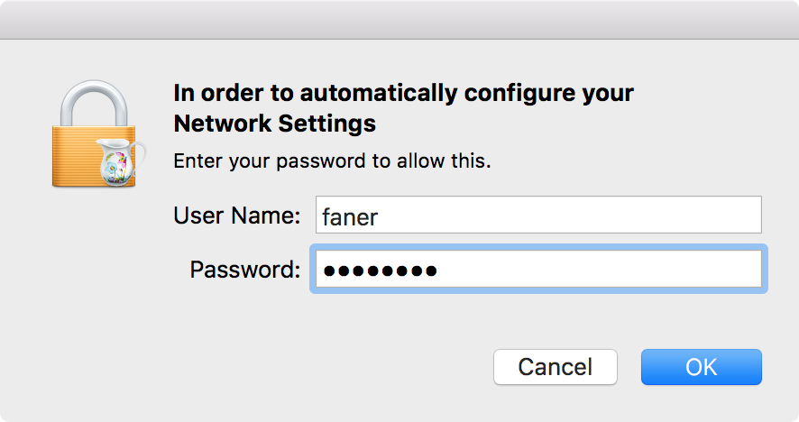

授权成功后，菜单 `Proxy | macOS Proxy` 呈勾选状态：

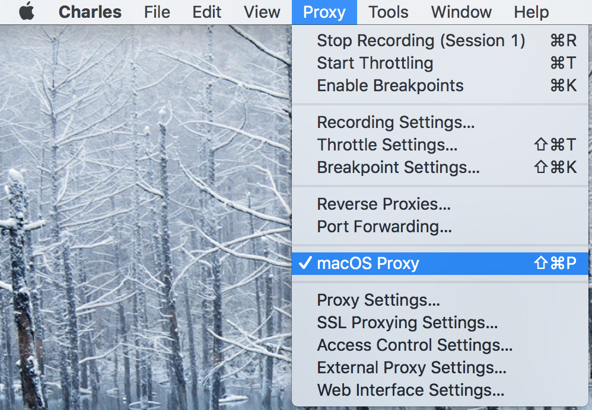

在系统偏好设置 网络设置 - 代理 中，Charles 将自己设置为 HTTP 和 HTTPS 代理：

- 网页代理（HTTP）：127.0.0.1 : 8888  
- 安全网页代理（HTTPS） 127.0.0.1 : 8888  

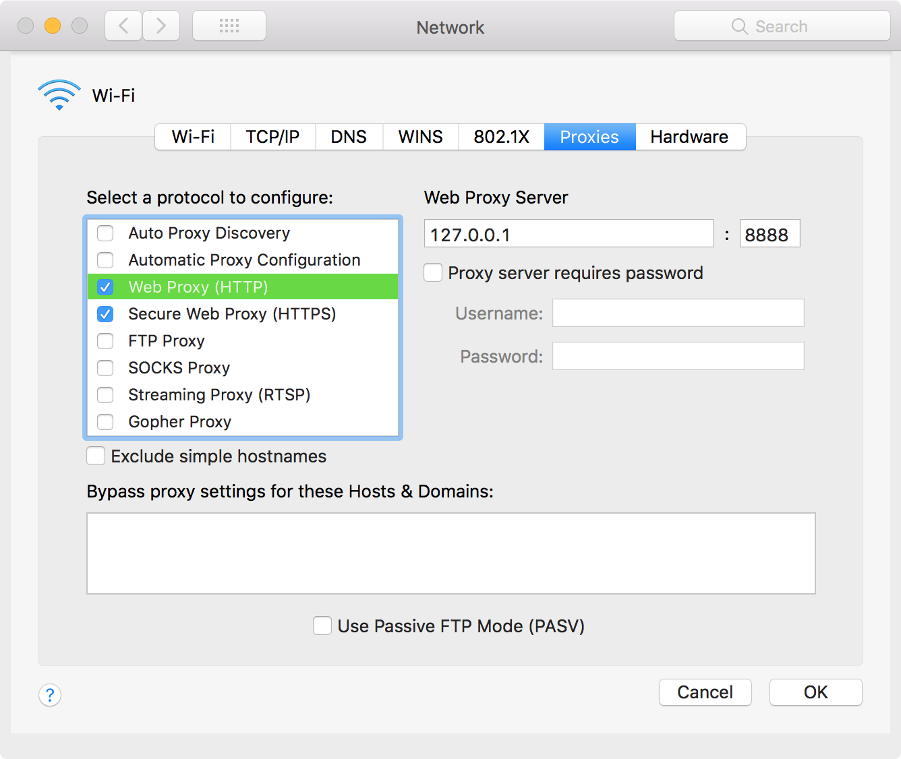

由于 macOS 下的浏览器（Safari & Chrome）等应用默认使用系统网络代理。

> The proxy server you set here will be used by Apple Safari, Google Chrome, and other applications that [respect your system proxy settings](https://www.howtogeek.com/293444/how-to-configure-a-proxy-server-on-a-mac/).

至此，Charles 已经在抓取 Chrome 访问的所有 HTTP 和 HTTPS 请求。

有些应用会忽略系统代理设置，导致包不走 [Charles](https://www.v2ex.com/t/359073) 代理，无法抓取。 此时，Android 下可用 [ProxyDroid](https://blog.csdn.net/codezjx/article/details/8872090) 强制[全局代理](https://blog.csdn.net/codezjx/article/details/8872071)。

---

退出关闭 Charles 时，将会自动恢复之前系统网络设置中的 HTTP 和 HTTPS 代理配置。

---

下次重启 Charles 时，需要到菜单 `Proxy` 中下拉选中 `macOS Proxy`，将 Charles 作为 macOS 系统代理。

## 偏好设置

### Launch

在 Charles Preferences 的 **Launch** 中，默认勾选了 `Open a new session`：

- [x] Open a new session

这会导致启动 Charles 时，默认开启会话（Session 1），并且开始记录（Recording）。

可反勾选 **Launch** 中的 `Open a new session`，这样每次启动就不会自动开启抓包。

后续启动 Charles，需要先到菜单中勾选 `Proxy | macOS Proxy`，再 `File | New Session` 开启会话抓包。

### Viewers

- [x] Combine header and body viewers  
- [x] Combine request and response  

可以按需反选以上两项配置。

## 显示列

Charles 默认有以下显示列：

1. Response Code   
2. Method  
3. Host  
4. Path  
5. Request Start Time   
6. Duration  
7. Size  
8. Status  
9. Info  

可右键列标题栏，添加以下信息：

- Protocol  
- Remote IP  
- Remote Port  
- Client IP  
- Client Port  
- SSL Handshake Duration  
- Request Size  
- Response Size  

## 过滤网络请求

启动 Charles 默认开始抓取活动网卡的所有 HTTP 通信包。可以在 `Filter` 中设置关键字，过滤出想要的目标通信包。

如果只向抓获目标网站的封包，则可以到菜单 `Proxy | Recording Settings` 的 include 中配置想要过滤的目标。

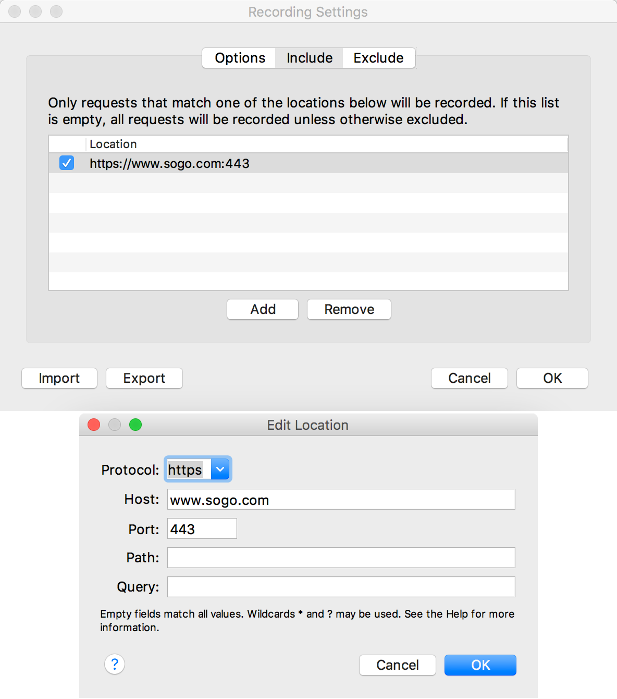

## HTTPS（SSL代理）

访问[搜狗首页](https://www.sogo.com/)，Charles 抓包如下：

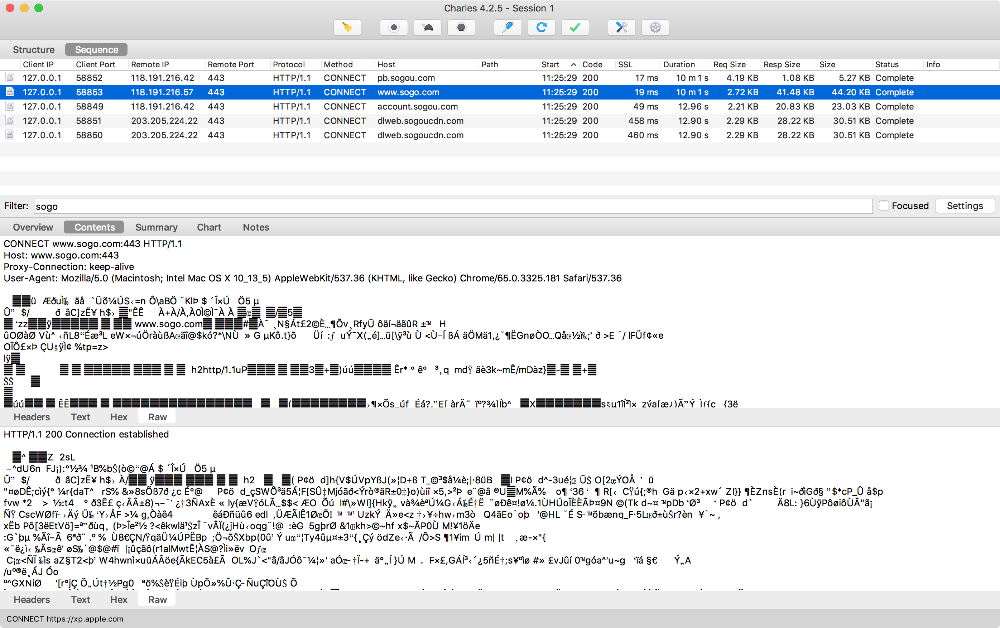

Notes 提示 `SSL Proxying not enabled for this host: enable in Proxy Settings, SSL locations`：

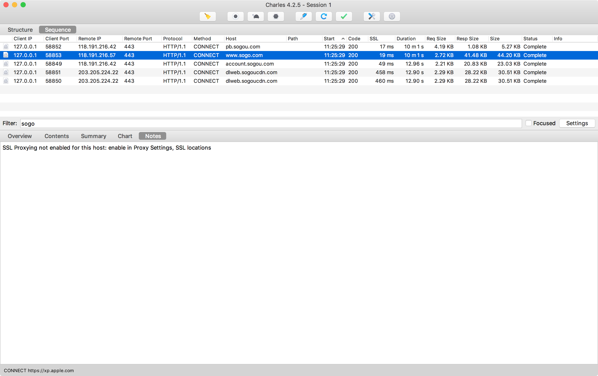

通过菜单 `Help | SSL Proxying | Install Charles Root Certificate` 安装 Charles 的 CA 根证书。

系统弹窗提示新根证书需要手动添加到 登录 的 证书 类别中：

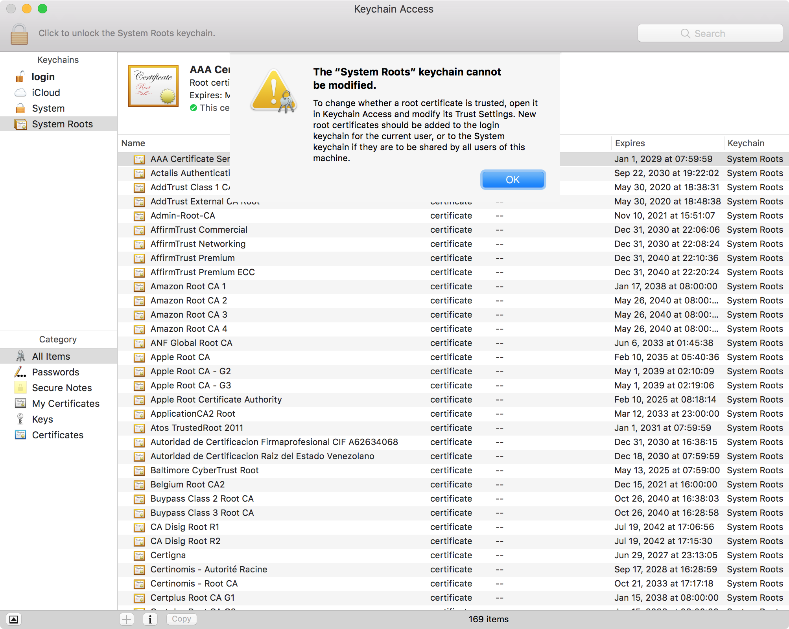

点击 OK 后，如果 Keychain Access 的 登录-证书 中没有 Charles Proxy CA，则再执行一次 `Help | SSL Proxying | Install Charles Root Certificate`。

提示 **证书不受信任**：

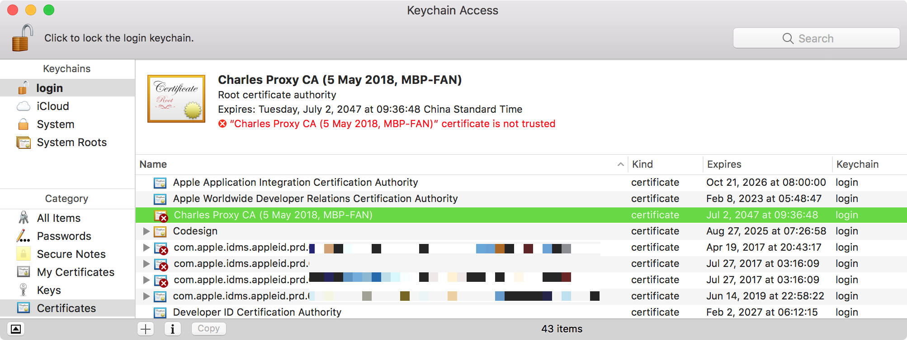

双击该证书，展开 Trust，将 When using this certificate 默认策略 Use System Defaults 改为 Always Trust。

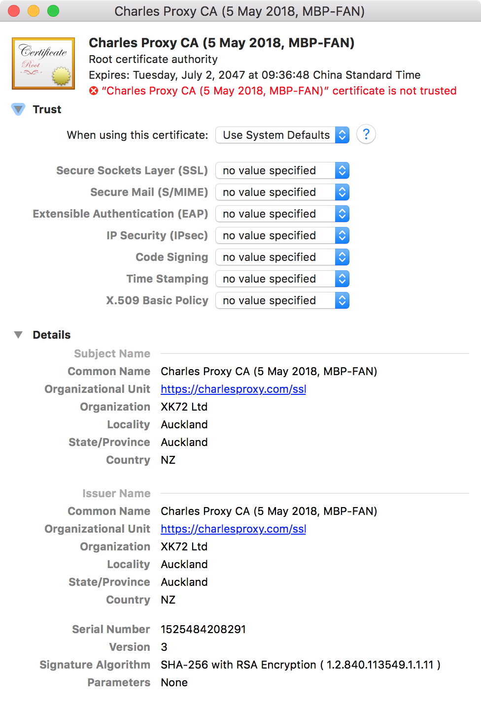

系统弹窗密码授权更改证书信任配置：

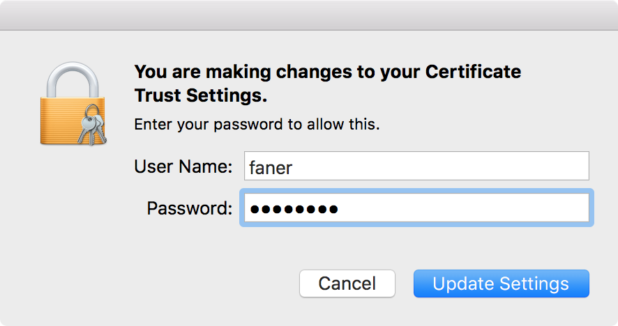

输入密码后，Charles Proxy CA 已置于信任状态：

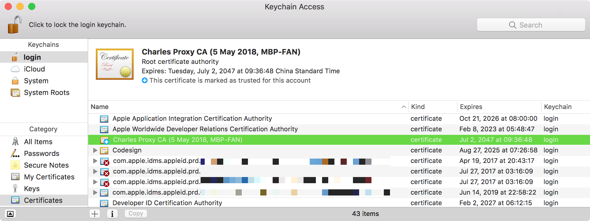

回到抓包会话窗口，右击 www.sogo.com 行，勾选 `Enable SSL Proxying` 将启用 SSL 代理：

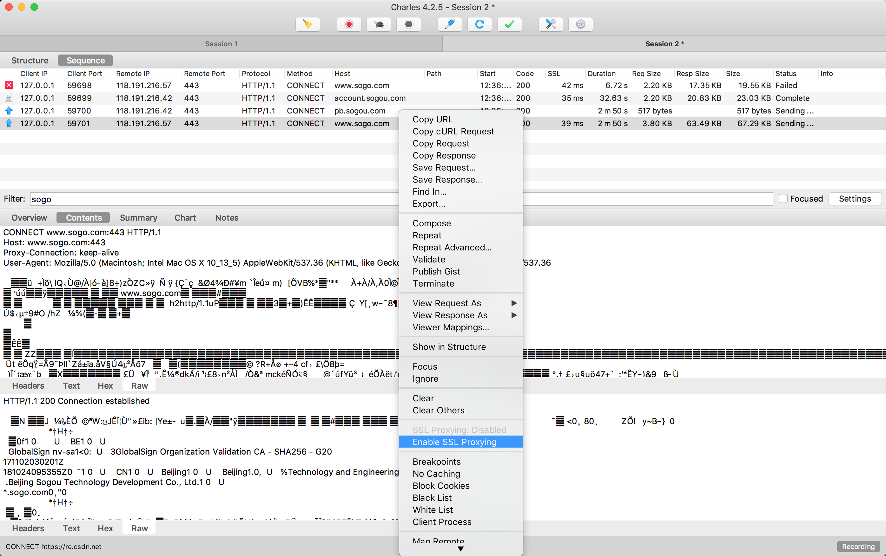

再次访问 <https://www.sogo.com/> ，则 Charles 代理了 HTTPS（SSL） 访问，可抓取解密后的 HTTP 报文：

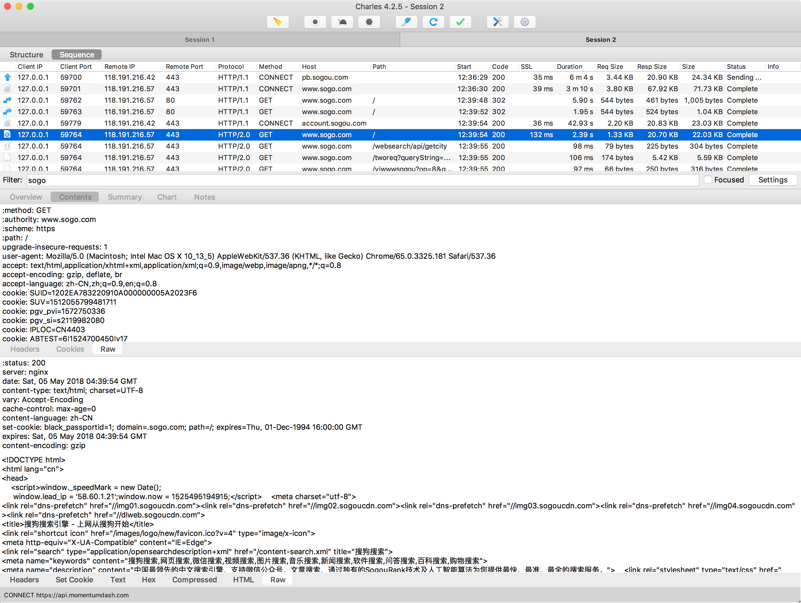

## 移动端

### 抓取移动端的 HTTP 包

#### Charles 上的设置

要截取 iPhone 上的网络请求，我们首先需要将 Charles 的代理功能打开。
其次，在 Charles 的菜单 `Proxy | Proxy Settings` 上填入代理端口 8888，并且勾上 `Enable transparent HTTP proxying`。

#### iPhone 上的设置

通过 Charles 菜单 `Help | Local IP Address` 可查看 Charles 所在机器（macOS）的IP地址。

在 iPhone 设置 | 无线局域网 中点击进入和 macOS 连接的相同局域网 WiFi 右侧的 `i` 图标，进入网络连接详情页。

点击 **配置代理**，进入选择 **手动**，服务器填写 macOS(Charles) 的 IP 地址；端口号填写 8888。

打开 iPhone 上的任意需要网络通讯的程序，就可以看到 Charles 弹出 iPhone 请求连接的确认菜单（如下图所示），点击 “Allow” 即可完成设置。

### 抓取移动端的 HTTPS 包

如果要截取移动设备中的 HTTPS 通讯信息，则需要在 iOS 或 Android 机器上截取 HTTPS 协议的通讯内容，还需要在手机上安装相应的证书。

点击 Charles 的顶部菜单，选择 `Help | SSL Proxying | Install Charles Root Certificate on a Mobile Device or Remote Browser`，然后就可以看到 Charles 弹出的安装提示。

1. 设置 iPhone/Android 的 HTTP 代理为 `10.4.16.162:8888`；  
2. 然后在 iPhone/Android 上访问 <http://chls.pro/ssl> 下载安装证书（`charles-proxy-ssl-proxying-certificate.pem`）。  
