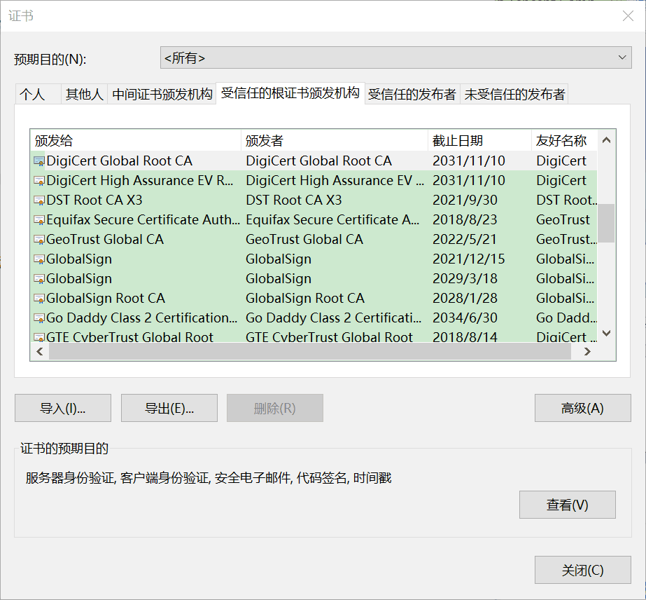

<!--TOC-->

## 证书的概念
**证书**是由公证处或认证机关开具的证明资格或权力的*证件*，它是表明（或帮助断定）事理的一个*凭证*。证件或凭证的尾部通常会烙印**公章**。

每个中国人一生可能需要70多个证件，含15种身份证明。证件中“必需的”有30到40个。  
将这些证件按时间顺序铺开，那就是一个天朝子民的一生——持**准生证**许可落地，以**户籍证明**入籍，以**身份证**认证身份，持**结婚证**以合法同居，最终以**死亡证**明注销。

## 数字证书的概念
***数字证书***就是互联网通讯中标志通讯各方身份信息的一串数字（比特流），提供了一种在 Internet 上验证通信**实体身份**的方式，其作用类似于司机的驾驶执照或日常生活中的身份证。

数字证书是由一个由权威机构——CA机构（CA = Certificate Authority），又称为**数字证书授权中心**（数字证书认证机构）颁发（发行）的，人们可以在网上用它来核对对方的身份。

- 数字证书是一个经 CA 数字签名的包含公开密钥拥有者信息以及公开密钥的文件。最简单的证书包含一个公开密钥、名称以及 CA 的数字签名。
- 数字证书还有一个重要的特征就是**时效性**：只在特定的时间段内有效。

数字证书中的公开密钥（公钥）相当于公章。

证书的**信任链条**（trust chain）是环环相扣的，***根证书***就是一开始就被信任的证书，是信任链的*起始点*。

在天朝子民的一生中，户籍证明可理解为等效的根证书：有了户籍证明，才能办理身份证；有了上流的身份证，才能办理下游居住证、结婚证、计划生育证、驾驶执照等认证。

## 根证书的概念
根证书是被严格限制和确认的，根证书的颁发者被称之为 **Root Certificate Authority**（Root CA）。

某一认证领域内的根证书是 CA 认证中心给自己颁发的证书（signed by itself，自行签名），安装根证书意味着对这个 CA 认证中心的信任。

那么由谁来保证信任链起点的安全呢？

现代网络操作系统都会内置（built into host system）一份可信的根证书列表（Firefox 的根证书列表独立于操作系统之外）。

所谓“可信的根证书列表”是指操作系统开发商通过严格地审核，将安全可靠、可被信任的 CA 机构纳入白名单，并将这些权威可信 CA 的根证书预安装到操作系统中。

> you ultimately have to implicitly trust the built-in certificates.

### Windows
Windows 下的根证书有：

- Microsoft Root Authority  
- Microsoft Root Certificate Authority  
- Symantec Enterprise Mobile Root for Microsoft  

在 Internet Explorer 中，通过菜单【工具 | Internet 选项 | 内容 | 证书】可以查看受信任的根证书颁发机构（或中间证书颁发机构）：



常见的权威 CA 根证书有：

```
AddTrust External CA Root（The USERTrust Network™）
Baltimore CyberTrust Root（DigiCert Baltimore Root）
DigiCert Global Root CA（DigiCert）
DigiCert High Assurance EV Root CA（DigiCert）
DST Root CA X3
GeoTrust Global CA
GeoTrust Primary Certification Authority
GlobalSign（颁发者：GlobalSign Root CA - R3；签名算法：sha256RSA——带 RSA 加密的 SHA-256）
GlobalSign（颁发者：GlobalSign Root CA - R2；签名算法：sha1RSA——带 RSA 加密的 SHA-1）
GlobalSign Root CA（组织：GlobalSign nv-sa）
Go Daddy Class 2 Certification Authority（组织：The Go Daddy Group, Inc.）
Go Daddy Root Certificate Authority - G2（组织：GoDaddy.com, Inc.）
QuoVadis Root Certification Authority（组织：QuoVadis Limited）
Starfield Class 2 Certification Authority
Starfield Services Root Certificate Authority（ - G2）（组织：Starfield Technologies, Inc.）
StartCom Certification Authority（签名算法：sha1RSA——带 RSA 加密的 SHA-1）
thawte Primary Root CA
thawte Primary Root CA - G3
UTN-USERFirst-Object（组织：The USERTRUST Network）
VeriSign Universal Root Certification Authority（组织单位：VeriSign Trust Network）
VeriSign Class 3 Public Primary Certification Authority - G5（组织单位：VeriSign Trust Network）
```

### macOS

苹果系统根证书默认被预装到 macOS 系统中，在 Keychain Access 系统根证书中可以找到 Apple Root CA 为自己颁发的根证书。


macOS 下的根证书有：

- Apple Root CA  
- Apple Root Certificate Authority  
	- Developer ID Certification Authority（系统根证书）  
	- Apple Worldwide Developer Relations Certification Authority（系统证书）  

#### 椭圆曲线公钥签名算法
**ECDSA**：Elliptic Curve Digital Signing Algorithm

1. 签名算法：带 SHA-256 的 ECDSA 签名；公共密钥算法：椭圆曲线公共密钥；参数为[椭圆曲线 secp256r1]  
2. 签名算法：带 SHA-384 的 ECDSA 签名；公共密钥算法：椭圆曲线公共密钥；参数为[椭圆曲线 secp384r1]  

macOS 预装了 Apple Root CA、GlobalSign、GeoTrust、Symantec、thawte、VeriSign 等权威机构的包含椭圆曲线公共密钥的根证书：

```
GlobalSign（组织单位：GlobalSign ECC Root CA - R4；带 SHA-256 的 ECDSA 签名）
GlobalSign（组织单位：GlobalSign ECC Root CA - R5；带 SHA-384 的 ECDSA 签名）
Apple Root CA - G3（组织单位：Apple Certification Authority；带 SHA-384 的 ECDSA 签名）
GeoTrust Primary Certification Authority - G2（组织：GeoTrust Inc.；带 SHA-384 的 ECDSA 签名）
Symantec Class 1/2/3 Public Primary Certification Authority - G4（组织单位：Symantec Trust Network；带 SHA-384 的 ECDSA 签名）
thawte Primary Root CA - G2（组织：thawte, Inc.；带 SHA-384 的 ECDSA 签名）
VeriSign Class 3 Public Primary Certification Authority - G4（组织单位：VeriSign Trust Network；带 SHA-384 的 ECDSA 签名）
```

## iOS 开发证书体系
### 根证书——WWDRCA
iOS 以及 Mac OS X 系统（在安装 Xcode 时）将自动安装 [AppleWWDRCA.cer](https://developer.apple.com/certificationauthority/AppleWWDRCA.cer) 这个中间证书（Intermediate Certificates），它实际上就是 iOS（开发）证书的证书，即**开发根证书**。

AppleWWDRCA.cer 是由苹果公司一级认证中心 Apple Certification Authority（Apple Root CA）给下属的二级证书机构 *Apple Worldwide Developer Relations Certification Authority*  颁发的证书。

Apple Root CA 之于  Apple Certification Authority 好比户籍证之于身份证；AppleWWDRCA.cer 之于 iOS（开发）证书则好比身份证之于驾驶证。


WWDRCA 二级证书路径如下：

```
Apple Root CA
└── Apple Worldwide Developer Relations Certification Authority
```

### 申请 iOS 开发证书
在 macOS 下通过 Keychain 证书助理从证书颁发机构请求申请证书（CSR：Certificate Signing Request）。

Keychain Access|Keys 中将新增一对非对称密钥对 Public/Private Key Pair（This signing identity consists of a public-private key pair that Apple issues）。

私钥 **private key** 始终保存在 Mac OS 的 Keychain Access 中，用于签名（CodeSign）本机对外发布的 App；公钥 **public key** 一般随证书（随Provisioning Profile，随 App 安装）散布出去，对 App 签名进行校验认证。  
用户必须妥善保存本地 Keychain 中的 private key，以防伪冒。


同时，keychain 将生成一个包含开发者身份信息和公钥的CSR（Certificate Signing Request）文件——`CertificateSigningRequest.certSigningRequest`。  
在 Apple 开发网站上传包含公钥的 CSR 文件作为换取证书的凭证（Upload CSR file to generate your certificate）。

在 Apple 开发网站上传 **CSR** 文件（Upload CSR file to generate your certificate），后台确认申请者的身份后，Apple Developer 开发证书颁发机构 WWDRCA 将为开发者颁发证书（ios_development.cer）并记录在案（Apple Member Center）。


数字证书包括 CSR 中的申请者身份信息（域名或邮箱地址）等公开明文部分，以及使用 CA 私钥对证书公开明文部分计算出的 HASH 摘要进行加密的数字签名部分。 

> 数字签名 = E{private key, HASH{cert info}}，可认证，不可抵赖。

iOS 开发证书三级证书路径如下：

```
Apple Root CA
└── Apple Worldwide Developer Relations Certification Authority
    └── iPhone Developer: *@gmail.com (**********)
```

从 Apple Member Center 网站下载证书到 Mac 上双击即可安装（当然也可在 Xcode 中添加开发账号自动同步证书和[生成]配置文件）。

手动点击 *.cer 安装证书到 macOS 时，Keychain Access 追溯其签发 CA 为AppleWWDRCA（Apple Worldwide Developer Relations Certification Authority），利用AppleWWDRCA 证书公钥对该开发证书数字签名进行解密和校验。校验成功会标记此证书有效（This certificate is valid）。

在 Keychain Access 的 Login | My Certificates 可查看到安装成功的证书。


在 Keychain Access 的 Login | Keys 中展开创建 CSR 时生成的 Key Pair 中的私钥前面的箭头，可以查看到包含其对应公钥的证书（Your requested certificate will be the public half of the key pair.）；在 Keychain Access|Certificates 中展开安装的证书（ios_development.cer）前面的箭头，可以看到其对应的私钥。


