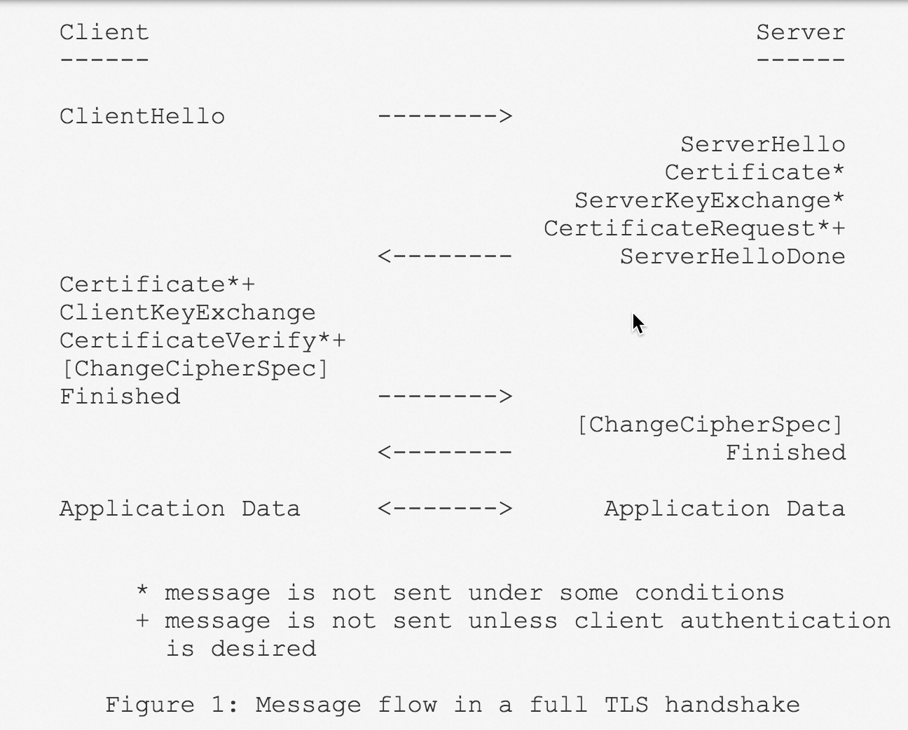
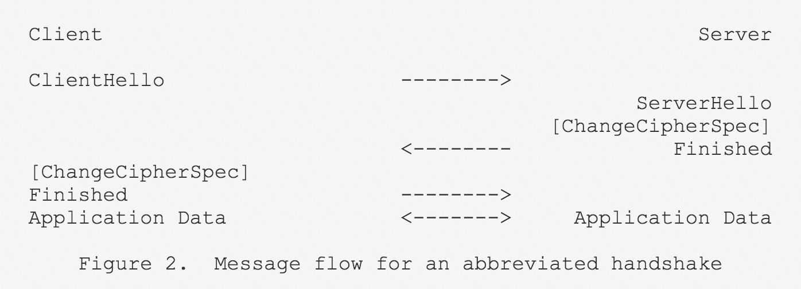
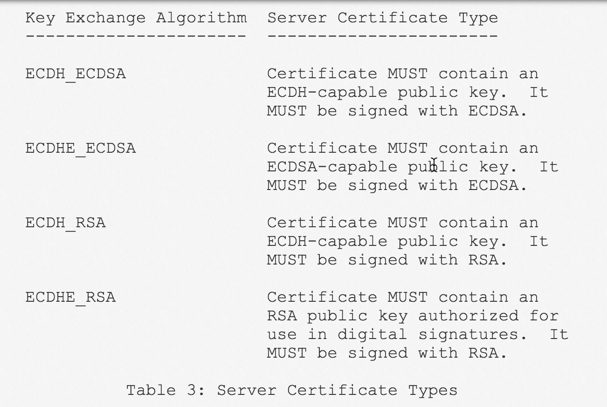
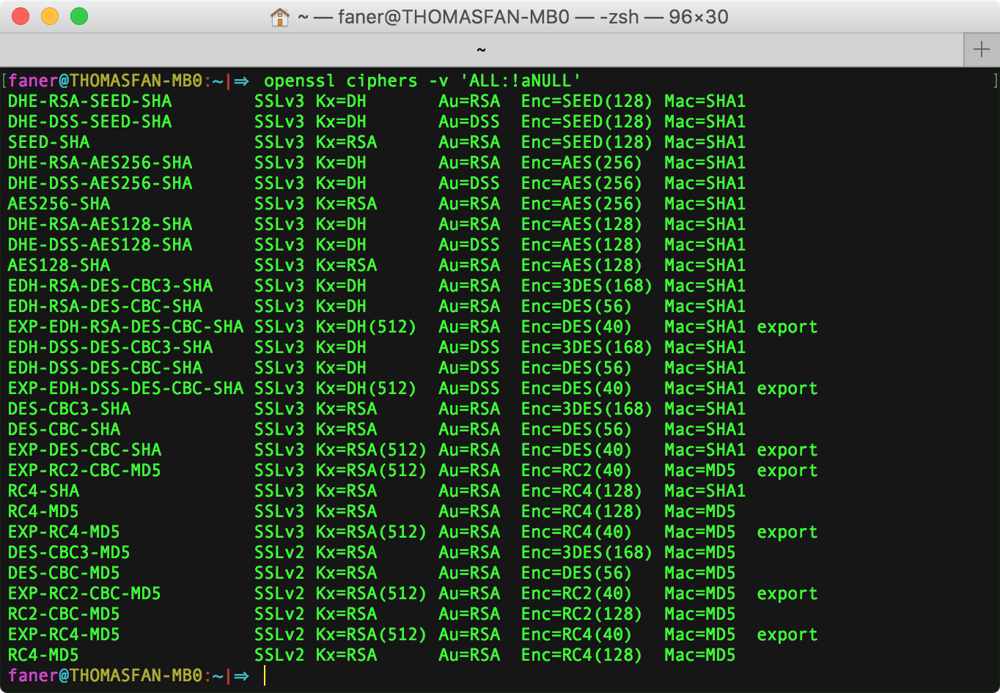

<!--TOC-->

《TCP/IP 详解 卷1：协议》 第2版 第18章 安全

## TLS rfc
### Protocol

- rfc2246: [Version 1.0](https://tools.ietf.org/html/rfc2246)  
- rfc4346: [ Version 1.1](https://tools.ietf.org/html/rfc4346)  
- **rfc5246**: [Version 1.2](https://www.ietf.org/rfc/rfc5246.txt)  

The protocol is composed of two layers: the TLS **Record** Protocol and the TLS **Handshake** Protocol.

#### Handshake
The TLS Handshake Protocol involves the following steps:

-  Exchange **hello** messages to agree on algorithms, exchange random values, and check for session resumption.  
-  Exchange the necessary **cryptographic** parameters to allow the client and server to agree on a ***premaster secret***.  
-  Exchange **certificates** and **cryptographic** information to allow the client and server to ***authenticate*** themselves.  
-  Generate a ***master secret*** from the premaster secret and exchanged random values.  
-  Provide security parameters to the record layer.  
-  Allow the client and server to ***verify*** that their peer has calculated the same security parameters and that the handshake occurred without tampering by an attacker.  

@img 

@img .png)

##### resumed from Session ID
**session identifier**: An arbitrary byte sequence chosen by the server to identify an active or resumable session state.  
“Server Hello” message contains a 32 byte session ID in case we want to reconnect without a big handshake.  

The client sends a `ClientHello` using the Session ID of the session to be resumed.  
The server then checks its session cache for a match.  

If a match is **found**, and the server is willing to re-establish the connection under the specified session state, it will send a `ServerHello` with the same Session ID value.  
At this point, both client and server MUST send `ChangeCipherSpec` messages and proceed directly to Finished messages.  
Once the re-establishment is complete, the client and server MAY begin to exchange application layer data.  

If a Session ID match is **not found**, the server generates a **new** session ID, and the TLS client and server perform a **full** handshake.

@img 

@img .png)

### Extensions

- [rfc3546](https://tools.ietf.org/html/rfc3546)  
- [**rfc4366**](https://tools.ietf.org/html/rfc4366)  

rfc4680: [TLS Handshake Message for Supplemental Data](https://tools.ietf.org/html/rfc4680)

	1. Message Flow with SupplementalData  
	2. Double Handshake to Protect Supplemental Data  

rfc4681: [TLS User Mapping Extension](https://tools.ietf.org/html/rfc4681)  
rfc5746: [Transport Layer Security (TLS) Renegotiation Indication Extension](https://tools.ietf.org/html/rfc5746)  

### ECDH
**rfc4492**: [Elliptic Curve Cryptography (ECC) Cipher Suites for Transport Layer Security (TLS)](https://tools.ietf.org/html/rfc4492)

**rfc5289**: [TLS Elliptic Curve Cipher Suites with SHA-256/384 and AES Galois Counter Mode (GCM)](https://tools.ietf.org/html/rfc5289)

rfc7919: [Negotiated Finite Field Diffie-Hellman Ephemeral Parameters for Transport Layer Security (TLS)](https://tools.ietf.org/html/rfc7919)

#### Server Certificate
@img 

## 密码学及安全技术栈
[密码学笔记](http://www.ruanyifeng.com/blog/2006/12/notes_on_cryptography.html)  
[【翻译】密码学一小时必知](https://blog.helong.info/blog/2015/04/12/translate-Everything-you-need-to-know-about-cryptgraphy-in-1-hour/)  
[现代密码学实践指南](https://blog.helong.info/blog/2015/06/06/modern-crypto/)  

### [理解SSL(https)中的对称加密与非对称加密](http://netsecurity.51cto.com/art/201407/444787.htm)
由早期密码学引入加密算法和加密类型（对称加密、非对称加密），进而阐述网站如何通过 SSL（安全套接层） 加密和用户安全通信。

### [数字签名和数字证书](http://blog.csdn.net/phunxm/article/details/16344837)
图解数字签名和数字证书基本概念。

### [白话数字签名](http://www.cnblogs.com/1-2-3/category/106003.html)
通俗易懂地讲解数字签名的原理和应用方法。
最后给出一个 B/S 信息系统使用数字签名技术的 Demo。

### [数字证书的基础知识](http://www.enkichen.com/2016/02/26/digital-certificate-based/)
- 对称加密(常见算法)  
- 非对称加密(常见算法)  
- 摘要算法(常见算法)  
- 数字签名  
- 数字证书(组成、验证、授权链)  

### [公钥、秘钥、对称加密、非对称加密总结](http://my.oschina.net/shede333/blog/359290)
网摘大杂烩。

### [和安全有关的那些事](http://blog.csdn.net/bluishglc/article/details/7585965)
安全技术堆栈。

[非对称加密原理解析](http://blog.csdn.net/wzzvictory/article/details/9015155)  
[非对称加密的设计原理是什么？](https://www.zhihu.com/question/23879943)  欧拉定理  
[如何用通俗易懂的话来解释非对称加密?](https://www.zhihu.com/question/33645891)  

### RSA
RSA算法原理：[一](http://www.ruanyifeng.com/blog/2013/06/rsa_algorithm_part_one.html) [二](http://www.ruanyifeng.com/blog/2013/07/rsa_algorithm_part_two.html)

[RSA加解密原理](https://www.zhihu.com/question/33645891/answer/159643267)  
[RSA做密钥协商(密钥交换)时，是否可以防范中间人攻击？](https://www.zhihu.com/question/25116415)  

### TLSPARAMS(Cipher Suites)
Transport Layer Security (TLS) Parameters [@ietf](https://www.ietf.org/assignments/tls-parameters/tls-parameters.txt) [@iana](https://www.iana.org/assignments/tls-parameters/tls-parameters.xhtml)

[SSL/TLS CipherSuite 介绍](https://blog.helong.info/blog/2015/01/23/ssl_tls_ciphersuite_intro/)  

[How do browsers negotiate SSL/TLS connection parameters?](https://security.stackexchange.com/questions/94799/how-do-browsers-negotiate-ssl-tls-connection-parameters)  
[What is ECDHE-RSA?](https://security.stackexchange.com/questions/14731/what-is-ecdhe-rsa)  
[What's the GCM-SHA 256 of a TLS protocol?](https://crypto.stackexchange.com/questions/26410/whats-the-gcm-sha-256-of-a-tls-protocol)  
[decompose cipher suite: TLS_ECDHE_ECDSA_WITH_AES_128_GCM_SHA256](https://crypto.stackexchange.com/questions/26410/whats-the-gcm-sha-256-of-a-tls-protocol)  
[Proposal to Change the Default TLS Ciphersuites Offered by Browsers](https://briansmith.org/browser-ciphersuites-01)  
[TLS 1.2 handshake problem?](http://grokbase.com/t/apache/users/126c3zespf/httpd-tls-1-2-handshake-problem)  
[TLS Version specific cipher suites](https://security.stackexchange.com/questions/130136/tls-version-specific-cipher-suites)  

> In SSL, the key exchange, symmetric encryption and MAC algorithm are all **grouped** together into a single aggregate notion called a [***cipher suite***](https://en.wikipedia.org/wiki/Cipher_suite).

> Before TLS version 1.3, a cipher suite is a named **combination** of authentication, encryption, message authentication code (MAC) and key exchange algorithms used to negotiate the security settings. The format of cipher suites is modified since TLS 1.3. In the current TLS 1.3 draft document, cipher suites are only used to negotiate encryption and HMAC algorithms.

每个 CipherSuite 分配有 2 字节的短整型来标识，[TLS Cipher Suite Registry](https://www.iana.org/assignments/tls-parameters/tls-parameters.xhtml#tls-parameters-4)  定义了 Value 对应的 Description：

Value |	Description  |	DTLS-OK |	Reference 
------|--------------|----------|--------------------------------
0xC0,0x2F |	TLS_ECDHE_RSA_WITH_AES_128_GCM_SHA256 |	Y |	[[RFC5289](http://www.iana.org/go/rfc5289)]

```C
CipherSuite TLS_ECDHE_RSA_WITH_AES_128_GCM_SHA256    = {0xC0,0x2F};
```

每个 Cipher Suite 是由4个算法原语组合而成：

- Key Exchange (Kx)：密钥交换协商协议。主流有两种：DH 和 ECDH。

	> 自从斯诺登爆料了 NSA 的 HTTPs 破解方案以后，现在的密钥交换算法，普遍流行 **PFS**（Perfect Forward Secrecy），把 DH, ECDH 变成 DHE,ECDHE 。  

- Authentication (Au)：非对称认证算法，常见有三种：DSA/RSA/ECDSA。  

	> 目前最主流的是 **RSA** ( 2048 bit 及以上)；ECDSA 是新兴趋势，例如 gmail，facebook 都在迁移到 ECDSA；DSA 由于只能提供1024bit，已被建议禁用。

- Encryption(Enc)：对称加密算法，主流趋势是使用 **AES**。

	> 其他的有：DES（已被淘汰）；RC4（不建议使用）；3DES（不建议使用）；Camellia（貌似日本人搞的） 等。

- Message Authentication Code(MAC)：消息认证码算法，主流有 SHA1、SAH256、SHA384 等。  

	> TLS 中使用了 **HMAC** 模式，而不是原始的 SHA1、SHA256 等；google 已在淘汰 MD5 了。  

通过 `openssl ciphers -v` 命令可以列举 OpenSSL 支持的所有 ciphers：



### OpenSSL
TLS/SSL 一共出过 5个版本：ssl2/ssl3/tls1.0/tls1.1/tls1.2 ，ssl2/ssl3 这两个版本漏洞太多，请务必禁用。

TLS1.2 是当前最新的 TLS 协议，定义在 rfc5246 中。

[TLS1.3](https://www.sslchina.com/introduction-to-tls1-3/) [概述](https://www.inforsec.org/wp/?p=1960)  [改进的握手：更多隐私更少延迟](http://www.linuxidc.com/Linux/2015-11/125288.htm)。

TLS 协议的实现有多种，如 openssl,gnutls,nss,libressl,cyassl,polarssl,botan 等等。  
openssl 的代码算是其中最混乱的，但是也是最久经考验的。 ( 请参见此打脸文： <http://blog.csdn.net/dog250/article/details/24552307>)

个人觉得 polarssl 和 botan 的架构最清晰，代码风格清新可爱，便于学习理解协议。但是不建议在生产环境下用，例如 polarssl 功能尚有欠缺。

[OpenSSL 详解](http://blog.csdn.net/w1781806162/article/details/46358747)  
[OpenSSL 之命令详解](http://shjia.blog.51cto.com/2476475/1427138)  

[OpenSSL简介－指令cipher](http://www.blogjava.net/ycyk168/archive/2009/11/27/303934.html)  
[OpenSSL命令---ciphers](http://blog.csdn.net/as3luyuan123/article/details/13609819)   [@cnblogs](http://www.cnblogs.com/LiuYanYGZ/p/6004990.html)  

[iOS编译OpenSSL静态库](http://www.jianshu.com/p/27c3393054da)  
[iOS编译OpenSSL静态库(使用脚本自动编译)](http://www.jianshu.com/p/651513cab181)  

[Mac中如何用openssl生成RSA密钥文件](http://www.jianshu.com/p/b06669a90bc6)  
[使用OpenSSL生成pfx、cer、crt证书](http://www.jianshu.com/p/0578b16cb775)  
[SSL协议、openSSL及创建私有CA](http://www.jianshu.com/p/658a4eb4d09f)  
[Mac OSX 使用OpenSSL生成RSA公匙、私匙（pem）与DER文件](http://www.jianshu.com/p/bb2bd32e8794)  

[SSL/TLS协议及Openssl工具的实现](http://www.jianshu.com/p/da65e5cd552e)  
[利用OpenSSL建立PKI数字证书系统](http://www.jianshu.com/p/143698fd8551)  

### SSH
SSH原理与运用：[一](http://www.ruanyifeng.com/blog/2011/12/ssh_remote_login.html) [二](http://www.ruanyifeng.com/blog/2011/12/ssh_port_forwarding.html)

#### [安全协议系列（四）----SSL与TLS](http://www.cnblogs.com/efzju/p/3674058.html)
本文使用 OpenSSL 提供的子命令 s_server/s_client 进行 TLS 通信。
利用 OpenSSL 自带的调试功能，来观察运行的内部细节，起到事半功倍的作用。

[在CentOS[lnmp]上部署新版本SSL协议+ECDHE_RSA正向加密和预防BEAST攻击](https://xuanwobbs.com.cn/archives/2013-07/centos-lnmp-ecdhe_rsa-beast.html)  
[OpenSSL 建立CA，服务器证书请求及签发，客户端测试连接，加密签名工具 等的详细步骤](http://blog.chinaunix.net/uid-174325-id-3563721.html)  

## HTTPs 扫盲科普
### [图解HTTPS](http://limboy.me/tech/2011/02/19/https-workflow.html)
比较简单。

### [HTTPS科普扫盲帖](http://www.cnblogs.com/chyingp/p/https-introduction.html)
比较系统。

### [HTTPS 工作原理和 TCP 握手机制](http://blog.jobbole.com/105633/)  
浏览器与网站互相发送加密的握手消息（Encryted Handshake Message）并验证，目的是为了保证双方都获得了一致的密码，并且可以正常的加密解密数据，为后续真正数据的传输做一次测试。

### [How HTTPS Secures Connections](https://blog.hartleybrody.com/https-certificates/) / [HTTPS是如何保证连接安全](http://blog.jobbole.com/45530/)
由浅入深，通俗易懂。
解释了 Diffie-Hellman 算法的数学原理。

### [The First Few Milliseconds of an HTTPS Connection](http://www.moserware.com/2009/06/first-few-milliseconds-of-https.html)
结合 wireshark 抓包，全面完整地剖析了 TLS 运行机制和技术细节。

There are no more levels on the **trust chain**.   [Reflections on Trusting Trust](http://www.ece.cmu.edu/~ganger/712.fall02/papers/p761-thompson.pdf)  
you ultimately have to implicitly trust the built-in certificates.  
The top root Certificate was **signed by itself** which has been built into host system.  

One final check that we need to do is to verify that the host name on the certificate is what we expected. 

## HTTPs 安全机制

### HTTPS 那些事
[（一）HTTPS 原理](http://www.guokr.com/post/114121/)  
[（二）SSL 证书](http://www.guokr.com/post/116169/)  
[（三）攻击实例与防御](http://www.guokr.com/blog/148613/)  

常见的证书根据用途不同大致有以下几种：

1. SSL证书，用于加密HTTP协议，也就是HTTPS。  
2. 代码签名证书，用于签名二进制文件，比如Windows内核驱动，Firefox插件，Java代码签名等等。  
3. 客户端证书，用于加密邮件。  
4. 双因素证书，网银专业版使用的USB Key里面用的就是这种类型的证书。  

对于SSL证书来说，如果访问的网站与证书绑定的网站一致就可以通过浏览器的验证而不会提示错误。

---

证书以***证书链***的形式组织，在颁发证书的时候首先要有**根CA机构**颁发的根证书，再由根CA机构颁发一个**中级CA机构**的证书，最后由中级CA机构颁发具体的SSL证书。

根证书是最关键的一个证书，如果根证书不受信任，它下面颁发的所有证书都不受信任。操作系统在安装过程中会默认安装一些受信任的CA机构的根证书。

在验证证书的时候，浏览器会调用系统的证书管理器接口对证书路径（Certification Path）中的所有证书一级一级的进行验证，只有路径中所有的证书都是受信的，整个验证的结果才是受信。

---

SSL证书**验证失败**有以下三点原因：

1. SSL证书不是由受信任的CA机构颁发的  
2. 证书过期  
3. 访问的网站域名与证书绑定的域名不一致  

---

对HTTPS最常见的攻击手段就是SSL证书欺骗或者叫SSL劫持，是一种典型的中间人攻击。

### [HTTPS 是如何保证安全的？](http://www.jianshu.com/p/b894a7e1c779)
杂谈论述。

 CA 的安全性由操作系统或浏览器来认证。

### [HTTPS 为什么更安全](http://blog.jobbole.com/110373/)
比较完整，图解例证。

### [也许，这样理解HTTPS更容易](http://blog.jobbole.com/110354/)
由浅入深，一步步解构还原 HTTPs 的设计过程。

### [HTTPS 背后的加密算法](http://insights.thoughtworkers.org/cipher-behind-https/)

## TLS 机制
[SSL and TLS Deployment Best Practices](https://github.com/ssllabs/research/wiki/SSL-and-TLS-Deployment-Best-Practices)  

### [SSL/TLS协议运行机制的概述](http://www.ruanyifeng.com/blog/2014/02/ssl_tls.html)

	> 三个随机数，前2个和第3个的关系？

C->S：EncryptWithPubKey {Premaster secret},
S decrypt with private key.

session key = {Client random, Server random, Premaster secret}

@img 

- `Server Key Exchange`：EC Diffie-Hellman Server Params  
- `Client Key Exchange`：EC Diffie-Hellman Client Params  
- `Encryted Handshake Message`：为 TLS Client Finished    
- `Encryted Handshake Message`：为 TLS Server Finished  

### [图解SSL/TLS协议](http://www.ruanyifeng.com/blog/2014/09/illustration-ssl.html)
基于 CloudFlare 提供的 Keyless 服务，来阐述 SSL 协议的握手过程 和 DH 算法的握手阶段。

### [SSL/TLS原理详解](https://segmentfault.com/a/1190000002554673)
全面翔实地讲解了非对称加密协商和 Secret Keys 派生关系。

[Https(SSL/TLS)原理详解](http://www.codesec.net/view/179203.html)  
[TLS协议分析 与 现代加密通信协议设计](https://blog.helong.info/blog/2015/09/07/tls-protocol-analysis-and-crypto-protocol-design/)  

#### Hello 协商加密套件与密码套件
在 `Client Hello` 报文中，客户端告诉服务器自己支持的 **TLS Version**、**Cipher Suites**、**Compression Methods** 和 **Extension**(server_name,elliptic_curves,ec_point_formats(Elliptic curves point formats),signature_algorithms,ALPN Protocol,Extended Master Secret) 等信息。

服务器收到 `Client Hello` 后，会结合双方支持的加密基础设施（proposed by the client and supported by the server），给客户端回应  `Server Hello` 反馈（in response to）选择的 TLS 版本以及密码套件（common Cipher Suite）。

在 **`github-未登录(tcp.port==55104&55109).pcapng`** 的 Packet 8 `Server Hello`  中包含 elliptic_curves 和 signature_algorithms 等 Extension，协商出的 Cipher Suite 为 *`TLS_ECDHE_RSA_WITH_AES_128_GCM_SHA256`*。

[**TLS_ECDHE_RSA_WITH_AES_128_GCM_SHA256**](http://www.iana.org/go/rfc5289) 解构如下：

1. **ECDHE_RSA**：密钥协商交换算法

	- **[ECDHE](https://security.stackexchange.com/questions/14731/what-is-ecdhe-rsa)**：使用基于椭圆曲线签密方案（EC, Elliptic Curve）的 Diffie-Hellman（DH）密钥协商协议。尾部的 <kbd>E</kbd> 为 Ephemeral 首字母，表示协商的是**临时**会话密钥。相对每次会话协商的临时密钥，证书中的公钥则是永久的（long-term）。  
	- **RSA**：证书公钥加密算法，用于对证书数据部分的散列值进行签密、对  ECDHE 交换参数（的 HASH 值）进行签密。可能替换值为 ECDSA（椭圆曲线数字签名算法）。  

	> rfc4492 & rfc5289 定义了该 CipherSuite 的具体实现。  
	> the long term authenticity is confirmed via the server cert's **RSA** signature but the transient keys are **derived** via ephemeral EC keys (which then generate the symmetric key)  
	> **ECDHE**-RSA uses Diffie-Hellman on an *elliptic curve* group while **DHE**-RSA uses Diffie-Hellman on a *modulo-prime* group.

2. **AES_128_GCM**：传输会话（对称）加解密使用 GCM 模式的 AES-128 算法。

	- **AES_128**：使用128位的会话对称加密算法，双方通过 ECDHE 交换参数协商出对称密钥。  
	- **GCM**：Galois计数器模式（[Galois/Counter Mode](https://en.wikipedia.org/wiki/Galois/Counter_Mode)）。消息认证码（MAC，Message Authentication Code）用于保障消息的**完整性**，防止各种伪造。AES-CMAC 使用分组密码，取代 HMAC 的加密散列函数。Galois 消息认证码（GMAC）则采用了 AES 算法的一种特殊模式。  

	> 主流加密算法趋势是 AES（128/256），加密模式的趋势是 GCM。  
	> GCM 是一种特殊的称为 AEAD 的加密模式，不需要配合 MAC。  

3. **SHA256**：消息认证码算法，基于有密钥的加密散列函数，用于创建消息摘要/指纹。

	> 使用安全散列算法2（SHA-2）生成256字节的摘要，确保消息的完整性（没有被篡改）。

#### 客户端基于 Certificate 和 Server Key Exchange 计算对称密钥
客户端首先要校验服务端下发证书（`Certificate`）的合法性（validates the certificate chain）：

1. 证书路径信任链逐级校验通过（证书确由可信 CA 认证签发）；  
2. 签名解密成功（确系证书持有者亲笔）；  
3. 从签名解析出的摘要和证书公开内容的摘要一致（证书内容完整，未被篡改）；  
4. 主题 CN 子域（Subject.CN）与 URL 中的 HOST 一致，综上确保访问的网站是来自预期目标服务器且非劫持或钓鱼。  

然后，客户端在接收到 `Server Key Exchange` 报文后，首先需要使用证书中的公钥对签名进行 RSA 解密并校验散列值。如果解密校验通过，则基于 ECDH[^ECDH] 参数中的 Pubkey（the server's ephemeral ECDH public key） 通过一定的算法计计算出 ***Pre-Master Secret***（resultant shared secret）。

@img -Server_Key_Exchange.png)

紧接着，客户端将基于 Client Hello、Server Hello 中的 2 个 28 bytes 随机数（Random）和这个 Pre-Master Secret 计算出用于派生后续传输所用对称密钥的种子—— ***Master Secret***（Shared Secret）。

> 两个 Hello 随机数都是明文透传。  
> ECDH 参数（EC Diffie-Hellman Server Params）携带了  Signatue，需要 Certificate 中的公钥进行 RSA 解密和 HASH 校验，从而保证整个握手协商的安全性。

Master Secret 作为数据加解密相关的 secret 的 Key Material 的一部分。  
**[Key Material](http://www.rosoo.net/a/201409/17053.html)** 的计算跟 Master Secret(Key) 的计算类似，只不过计算的次数要多。
Key Material需要计算12次，从而产生12个hash值。产生12个hash之后，紧接着就可以从这个 Key Material 中获取 ***Session Secret*** 了。


- Client/Server write MAC key：用来对数据完整性进行验证；  
- Client/Server write encryption key：用来对数据进行加解密的 **Session Secret**（Session Key）。  

---

在收到 `Server Hello Done` 且客户端已成功协商计算出 Session Secret 之后，客户端向服务器发送 `Client Key Exchange`、`Change Cipher Spec` 和 `Encryted Handshake Message` 报文 。  

1. 发送 `ChangeCipherSpec`，表示客户端确认接受 Server Hello 中服务器选定的 Cipher Suite。  
2. 发送 `Client Key Exchange`，这样服务器也能基于 `Server Hello` 指定的 Cipher Suite 和 Client Hello、Server Hello 中的 2 个 28 bytes 随机数以及 Client Key Exchange 中的 ECDH 参数最终协商出 Session Secret。  
3. 发送 `Encryted Handshake Message`，表示客户端基于计算出的会话密钥加密一段数据（verify_data，Finished message），在正式传输应用数据之前对握手协商的会话加解密通道进行验证。

	> 服务器只有确保收到了 `Change Cipher Spec`、`Client Key Exchange` 报文并成功协商出了 Session Secret，才能解密（验证）加密的 Finished message。  

#### 服务端基于 Client Key Exchange 计算对称密钥
服务器在收到客户端的 `ChangeCipherSpec` 报文后，也回应一个 `ChangeCipherSpec`  告知客户端确定使用双方都支持确认的 Cipher Suite。

服务端在接收到 `Client Key Exchange` 报文后，基于 ECDH 参数中的 Pubkey 通过一定的算法计计算出 ***Pre-Master Secret***（resultant shared secret）。

@img -Client_Key_Exchange.png)

然后，服务端再基于 Client Hello、Server Hello 中的 2 个 28 bytes 随机数（Random）和这个 Pre-Master Secret 计算出用于派生后续传输所用对称密钥的种子—— ***Master Secret***（Shared Secret）。

> ECDH 参数（EC Diffie-Hellman Client Params）使用 Certificate 中的公钥加密，需要使用对应的私钥解密——只有持有证书的服务器才能解开，确保了交换参数的安全性。  

Master Secret 作为数据加解密相关的 secret 的 Key Material 的一部分，最终从 Key Material 中获取用于会话加密的对称密钥 ***Session Secret***（Session Key）。

---

服务端在接收到客户端发过来的 `Encryted Handshake Message` 后，若使用 Session Secret 能解密出原始校验数据（verify_data，Finished message），则表明 C->S 方向的加解密通道就绪。  
同时，服务器也会给客户端发送一份使用 Session Secret 加密的校验数据报文 `Encryted Handshake Message`。若客户端也能正确解密，则表明 S->C 方向的加解密通道就绪。

至此，基于非对称加解密（私钥签名公钥解密，公钥加密私钥解密）和 ECDHE 协商出来的对称会话密钥，已被 C=S 双向通道验证，TLS HandShake 成功。

#### HTTP over TLS（HTTPs）
接下来，双方可以使用协商计算出的 Session Secret 和 ALPN Protocol 来进行应用数据（**Application Data**）的加密传输。

具体来说，双方以 Session Secret 为对称密钥，使用 AES 对称加密算法对 HTTP  Request/Response 报文进行加密传输。

所谓 ***HTTPs*** 全称为 Hyper Text Transfer Protocol over Secure Socket Layer，意即 over TLS 的 Secure HTTP。

## wireshark 抓包
[利用WireShark破解网站密码](http://www.freebuf.com/articles/network/59664.html)  
[使用wireshark观察SSL/TLS握手过程--双向认证/单向认证](http://blog.csdn.net/fw0124/article/details/40983787)  

[逆向wireshark学习SSL协议算法](http://sanwen8.cn/p/27ebPa7.html)  
[用Wireshark轻松解密TLS浏览器流量](http://bobao.360.cn/learning/detail/249.html)  
[wireshark解密用临时秘钥加密的ssl/tls数据包](http://blog.csdn.net/gufachongyang02/article/details/52166285)  

## SSL Settings
[百度全站 HTTPS 实践](http://blog.csdn.net/bd_zengxinxin/article/details/51115604)  
[Strong SSL Security on nginx](https://raymii.org/s/tutorials/Strong_SSL_Security_On_nginx.html)  
[Nginx下配置高性能，高安全性的https TLS服务](https://blog.helong.info/blog/2015/05/09/https-config-optimize-in-nginx/)  

[Google Chrome SSL Settings](http://googlechrometutorial.com/google-chrome-advanced-settings/Google-chrome-ssl-settings.html)  
[How to View SSL Certificate Details in Chrome 56](https://www.thesslstore.com/blog/how-to-view-ssl-certificate-details-in-chrome-56/)  
[How Do You View SSL Certificate Details in Google Chrome?](https://www.howtogeek.com/292076/how-do-you-view-ssl-certificate-details-in-google-chrome/)  

[Enabling SSL Versions TLS 1.1 & TLS 1.2](http://www.bachddsoc.org/print_files/Instructions-enabling-TLS.pdf)  
[How do I enable SSL 3.0/TLS 1.0 on Google Chrome?](https://productforums.google.com/forum/#!msg/chrome/tG8TVEG6V8I/SH_Jf4U-TEEJ)  

In order to enable TLS 1.0 in chrome do the following: 

1.  Click the wrench icon  
2.  Choose Options  
3.  Select "Under the Hood" Tab  
4.  Click Change proxy settings  
5.  Select "Advanced" Tab  
6.  Scoll down and check TLS 1.0  
7.  Close and restart all open browsers.  

[Turn Off SSL 3.0 and TLS 1.0 in Your Browser](https://www.ssl.com/how-to/turn-off-ssl-3-0-and-tls-1-0-in-your-browser/)  
[How to disable SSL3 and enable TLS for various browsers?](http://info.maybank2u.com.sg/eservices/personal/faq/faq-browser.aspx)  

[^ECDH]: [Elliptic curve Diffie–Hellman](https://en.wikipedia.org/wiki/Elliptic_curve_Diffie%E2%80%93Hellman) (ECDH) is an anonymous key agreement protocol that allows two parties, each having an elliptic curve **public–private** key pair, to establish a **shared secret** over an insecure channel.This shared secret may be *directly used* as a key, or *to derive another key*. The key, or the derived key, can then be used to encrypt subsequent communications using a ***symmetric key cipher***. It is a variant of the Diffie–Hellman protocol using elliptic curve cryptography.
