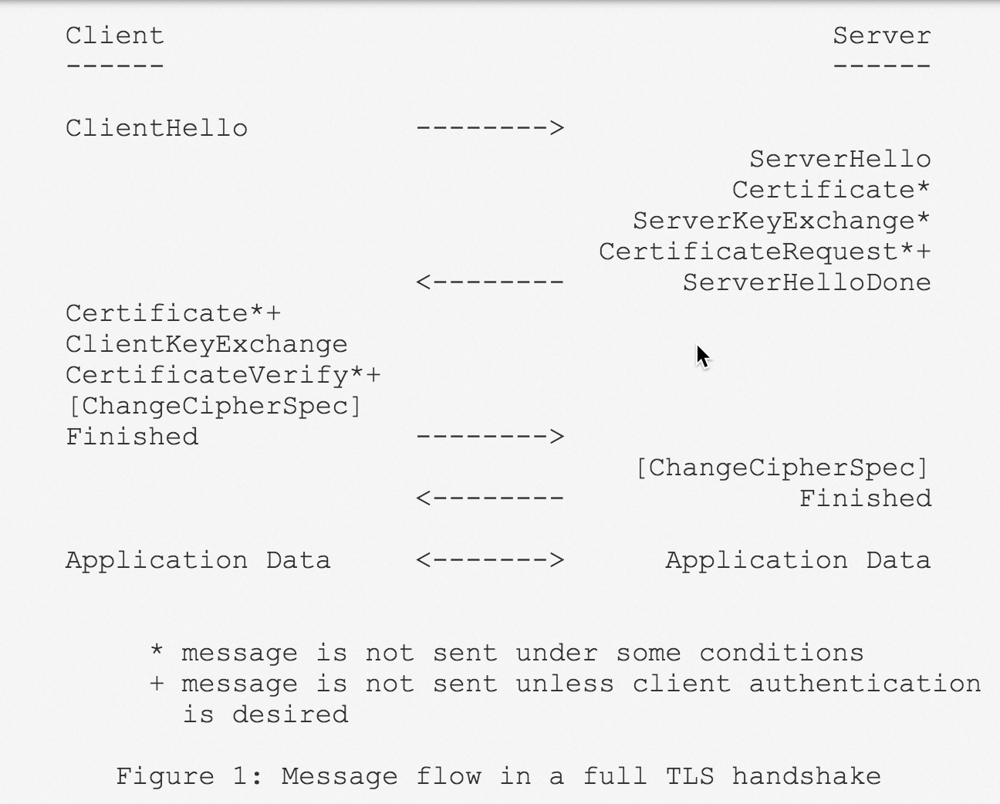
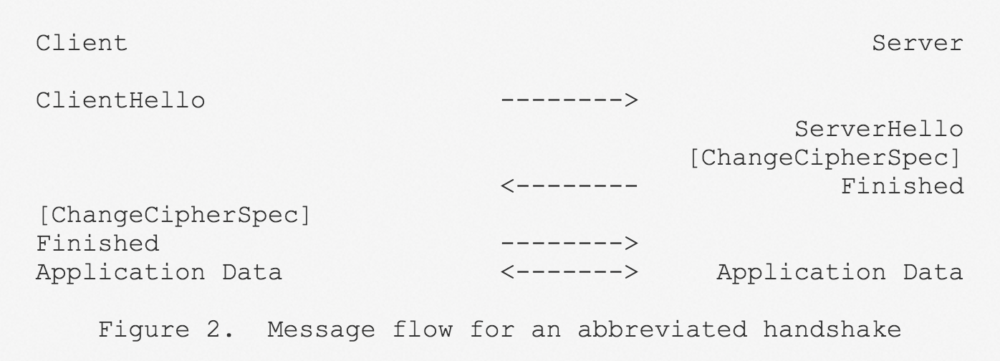
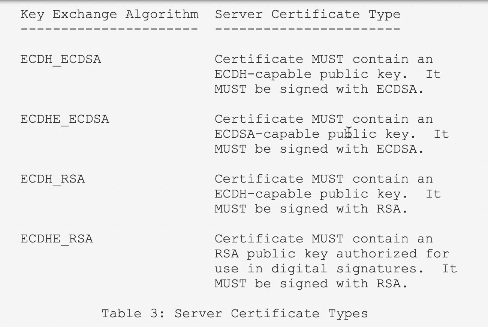

# TLS Handshake Flow（extracts from RFCs）

## Abstract
The TLS protocol provides communications security over the Internet.  
The protocol allows client/server applications to communicate in a way that is designed to prevent **eavesdropping**（窃听）, **tampering**（篡改）, or message **forgery**（伪造）.

The protocol is composed of two layers: the TLS **Record** Protocol and the TLS **Handshake** Protocol.

## Standard

- rfc2246: [Version 1.0](https://tools.ietf.org/html/rfc2246)  
- rfc4346: [ Version 1.1](https://tools.ietf.org/html/rfc4346)  
- **rfc5246**: [Version 1.2](https://www.ietf.org/rfc/rfc5246.txt)  

### Handshake
The TLS Handshake Protocol involves the following steps:

-  Exchange **hello** messages to agree on algorithms, exchange **random** values, and check for session resumption.  
-  Exchange the necessary **cryptographic** parameters to allow the client and server to agree on a ***premaster secret***.  
-  Exchange **certificates** and **cryptographic** information to allow the client and server to ***authenticate*** themselves.  
-  Generate a ***master secret*** from the premaster secret and exchanged random values.  
-  Provide security parameters to the record layer.  
-  Allow the client and server to ***verify*** that their peer has calculated the same security parameters and that the handshake occurred without tampering by an attacker.  

@img 

@img .png)

### resumed from Session ID
**session identifier**: An arbitrary byte sequence chosen by the server to identify an active or resumable session state.  
“Server Hello” message contains a 32 byte session ID in case we want to **reconnect** without a big handshake.  

The client sends a `ClientHello` using the Session ID of the session to be **resumed**.  
The server then checks its session cache for a match.  

If a match is **found**, and the server is willing to re-establish the connection under the specified session state, it will send a `ServerHello` with the ***same*** Session ID value.  
At this point, both client and server MUST send `ChangeCipherSpec` messages and proceed directly to Finished messages.  
Once the re-establishment is complete, the client and server MAY begin to exchange application layer data.  

If a Session ID match is **not found**, the server generates a **new** session ID, and the TLS client and server perform a **full** handshake.

@img 

@img .png)

## Extensions

[rfc3546](https://tools.ietf.org/html/rfc3546)/**rfc4366**: [Transport Layer Security (TLS) Extensions](https://tools.ietf.org/html/rfc4366)

rfc4680: [TLS Handshake Message for Supplemental Data](https://tools.ietf.org/html/rfc4680)

	1. Message Flow with SupplementalData  
	2. Double Handshake to Protect Supplemental Data  

rfc4681: [TLS User Mapping Extension](https://tools.ietf.org/html/rfc4681)  
rfc5746: [Transport Layer Security (TLS) Renegotiation Indication Extension](https://tools.ietf.org/html/rfc5746)  

## ECDH
**rfc4492**: [Elliptic Curve Cryptography (ECC) Cipher Suites for Transport Layer Security (TLS)](https://tools.ietf.org/html/rfc4492)

**rfc5289**: [TLS Elliptic Curve Cipher Suites with SHA-256/384 and AES Galois Counter Mode (GCM)](https://tools.ietf.org/html/rfc5289)

rfc7919: [Negotiated Finite Field Diffie-Hellman Ephemeral Parameters for Transport Layer Security (TLS)](https://tools.ietf.org/html/rfc7919)

### Server Certificate
@img 

## 参考
[The SSL/TLS Handshake: an Overview](https://www.ssl.com/article/ssl-tls-handshake-overview/)  
[An overview of the SSL or TLS handshake](https://www.ibm.com/support/knowledgecenter/en/SSFKSJ_7.1.0/com.ibm.mq.doc/sy10660_.htm)  
