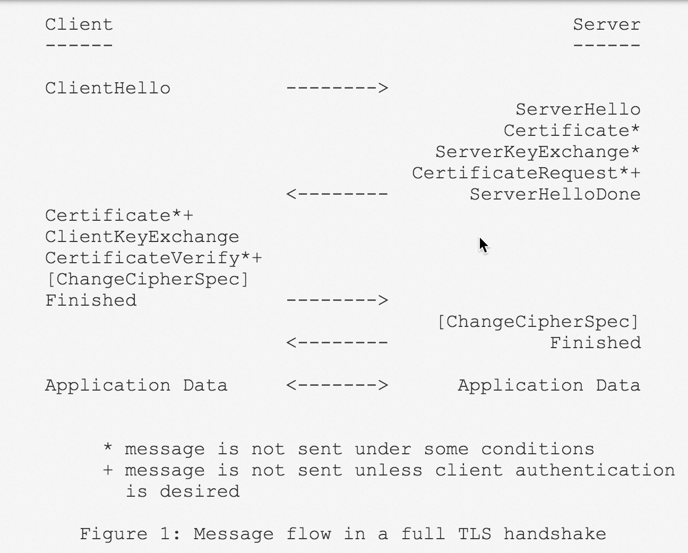
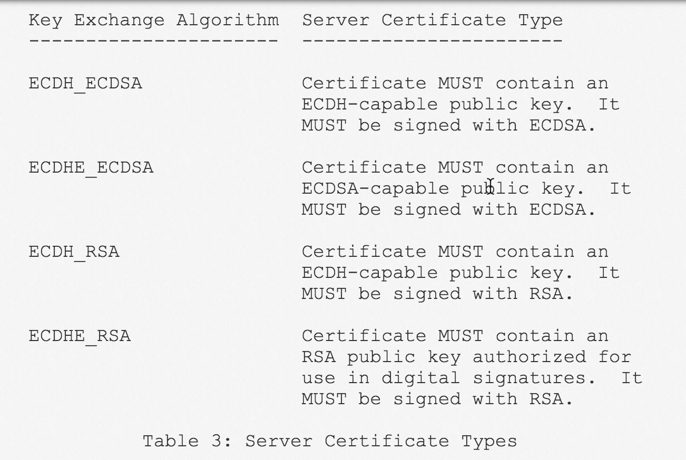

[The Transport Layer Security (TLS) Protocol Version 1.2](http://www.rfcreader.com/#rfc5246)

[Elliptic Curve Cryptography (ECC) Cipher Suites for Transport Layer Security (TLS)](http://www.rfcreader.com/#rfc4492)

The TLS Handshake Protocol involves the following steps:

-  Exchange **hello** messages to agree on algorithms, exchange random values, and check for session resumption.  
-  Exchange the necessary **cryptographic** parameters to allow the client and server to agree on a ***premaster secret***.  
-  Exchange **certificates** and **cryptographic** information to allow the client and server to ***authenticate*** themselves.  
-  Generate a ***master secret*** from the premaster secret and exchanged random values.  
-  Provide security parameters to the record layer.  
-  Allow the client and server to ***verify*** that their peer has calculated the same security parameters and that the handshake occurred without tampering by an attacker.  

@img 

@img 

@img 

## github-未登录(tcp.port==55104&55109).pcapng

1. C->S：Client Hello  
2. S->C：Server Hello  
3. S->C：Certificate, Server Key Exchange, Server Hello Done  
4. C->S：Client Key Change  
5. C->S：Change Cipher Spec  
6. C->S：Encryted Handshake Message  
7. S->C：Change Cipher Spec, Encryted Handshake Message  
8. C->S/S->C：Application Data  

---

在 Wireshark 解析树中，TLS 为 Secure Sockets Layer。

[A TLS message may span multiple TLS records](http://www.networksorcery.com/enp/protocol/tls.htm).  
[TLS wraps all traffic in “records” of different types](http://www.moserware.com/2009/06/first-few-milliseconds-of-https.html).   

The handshake record is broken out into several messages.

第 1、2、3、4、6、7.2 步均为 TLSv1.2 Record Layer 中的 ***Handshake Protocol***，  
第 5、7.1 步为 TLSv1.2 Record Layer 中的 ***Change Cipher Spec Protocol***，  
第 8 步为 TLSv1.2 Record Layer 中的 ***Application Data Protocol***: `http-over-tls`。

### Client Hello
TLSv1.2 Record Layer: Handshake Protocol: Client Hello

> ssl.record.content_type=0x16  
> ssl.handshake.type=0x01  

- TLS Version  
- Random  
- [Cipher Suites](http://www.networksorcery.com/enp/protocol/tls.htm)  
- Compression Methods  
- Extension: server_name(Server Name Indication extension)  
- Extension: elliptic_curves(EllipticCurveList)  
- Extension: ec_point_formats(ECPointFormatList)  
- Extension: signature_algorithms  
- Extension: next_protocol_negotiation  
- Extension: Application Layer Protocol Negotiation(ALPN Protocol)  
- Extension: signed_certificate_timestamp  
- Extension: Extended Master Secret  

ssl.record 头部的 Version 为 TLS 1.0(0x0301)，为客户端首次发起 Hello 选择的最低版本。ssl.handshake 报文中的 Version 为 TLS 1.2(0x0303)，为客户端支持的 TLS 最高版本。

所有的枚举能力项（Cipher Suites,Compression Methods,elliptic_curves,ec_point_formats,signature_algorithms,etc）都是按照从高到低的优先级排列(favorite choice first)。

Signature Hash Algorithm 包括 Hash 算法 和 Signature 算法。

### Server Hello
TLSv1.2 Record Layer: Handshake Protocol: Server Hello

> ssl.record.content_type=0x16  
> ssl.handshake.type=0x02  

- TLS Version  
- Random  
- **Session ID**,  (黑体新增)  
- *Cipher Suite*,  (斜体协定)  
- *Compression Method*  
- Extension: renegotiation_info  
- Extension: server_name(Server Name Indication extension)  
- **Extension**: ec_point_formats(ECPointFormatList)  
- Extension: *Extended Master Secret*  
- Extension: Application Layer Protocol Negotiation(*ALPN Next Protocol: http/1.1*)  

ssl.record 头部的 Version 为 TLS 1.2(0x0303)，表示 Server 回应 Hello 使用的版本为 TLS  1.2。ssl.handshake 报文中的 Version 也为 TLS 1.2(0x0303)。

Hello Extensions is "**client-oriented**": 
 
> the extension type **MUST NOT** appear in the extended server hello unless the same extension type appeared in the corresponding client hello.
> the extended server hello message is **only** sent in response to an extended client hello message.

ssl.record 总长117，各部分长度构成如下：

- sizeof(ssl.record.content_type)=1  
- sizeof(ssl.record.version)=2  
- sizeof(ssl.record.length)=2  
- sizeof(ssl.handshake)=112  

报文(#8)  帧长 1490（tcp payload 长度为 1424），出现了 TCP 报文流粘连，117 字节的 Server Hello 后面还有 1307 个字节是服务器发送的证书报文。

### Certificate
TLSv1.2 Record Layer: Handshake Protocol: Certificate

> ssl.record.content_type=0x16  
> ssl.handshake.type=0x0b  

This message conveys the server's certificate chain to the client.

报文(#8) 包含证书的前 1307 个字节，报文(#9)为证书的中间部分（TCP Segment Len: 1424）。

报文(#10) 帧长 827（tcp payload 长度为 761），也出现了 TCP 报文流粘连：

- 414 字节的证书结尾部分；  
- 338 字节的 `Server Key Exchange` 报文；  
- 9 字节的 `Server Hello Done` 报文。

整个证书 `Certificate` 报文由3个TCP流组成：

> [3 Reassembled TCP Segments (3145 bytes): #8(1307), #9(1424), #10(414)]

ssl.record 各部分长度构成如下：

- sizeof(ssl.record.content_type)=1  
- sizeof(ssl.record.version)=2  
- sizeof(ssl.record.length)=2  
- sizeof(ssl.handshake)=3140  

@img -Certificate.png)

根据 [rfc4492](https://tools.ietf.org/html/rfc4492) 中的描述，The server's Certificate message is capable of carrying a **chain** of certificates.

该报文下发了 GitHub 机构旗下 github.com 网站的证书及其颁发机构 DigiCert 的证书：

```Shell
// 二级证书(1917 bytes)
Certificate: 3082077930820661a00302010202100bfdb4090ad7b5e640... (id-at-commonName=github.com,id-at-organizationName=GitHub, Inc.,id-at-localityName=San Francisco,id-at-stateOrProvinceName=California,id-at-countryName=US,id-at-postalCode=9

// 一级证书(1210 bytes)
Certificate: 308204b63082039ea00302010202100c79a944b08c119520... (id-at-commonName=DigiCert SHA2 Extended Validation Server CA,id-at-organizationalUnitName=www.digicert.com,id-at-organizationName=DigiCert Inc,id-at-countryName=US)
```

wireshark 右键菜单 **`导出分组字节流`**，可导出 Certificate 字段值的分组字节流（raw 二进制），并保存为 *.cer。在 macOS 下双击自动将证书导入钥匙串（Keychain Access），然后在钥匙串中可双击打开查看证书内容。

#### Actions of the receiver
The client **validates** the certificate chain, **extracts** the server's public key, and **checks** that the key type is appropriate for the negotiated key exchange algorithm.

### Server Key Exchange
TLSv1.2 Record Layer: Handshake Protocol: Server Key Exchange

> ssl.record.content_type=0x16  
> ssl.handshake.type=0x0c  

This message is used to convey the server's ephemeral ECDH public key (and the corresponding elliptic curve domain parameters) to the client.

@img -Server_Key_Exchange.png)

交换 ECDH 参数（EC Diffie-Hellman Server Params）：

- TLS Version  
- Curve Type: named_curve  
- Named Curve: secp256r1  
- Pubkey  
- Signature Hash Algorithm(Hash: SHA512, Signature: RSA)  
- Signature  

传输了 Curve Type 及其对应值（elliptic curve domain parameters）、Pubkey（The ephemeral ECDH public key） 及其对应签名(及其散列签名算法)。

#### Actions of the sender/receiver
The server selects elliptic curve domain parameters and an ephemeral ECDH public key corresponding to these parameters according to the ECKAS-DH1 scheme from IEEE 1363 [6].

The client verifies the signature (when present) and retrieves the server's elliptic curve domain parameters and ephemeral ECDH public key from the ServerKeyExchange message.

### Server Hello Done
TLSv1.2 Record Layer: Handshake Protocol: Server Hello Done

> ssl.record.content_type=0x16  
> ssl.handshake.type=0x0e  

The ServerHelloDone message is sent by the server to **indicate** the end of the ServerHello and associated messages.  
After sending this message, the server will wait for a client response.  

### Client Key Exchange
TLSv1.2 Record Layer: Handshake Protocol: Client Key Exchange

> ssl.record.content_type=0x16  
> ssl.handshake.type=0x10  

@img -Client_Key_Exchange.png)

交换 ECDH 参数（EC Diffie-Hellman Client Params）：

- TLS Version  
- Pubkey  

It MUST immediately follow the client certificate message, if it is sent.  Otherwise, it MUST be the first message sent by the client **after** it receives the ServerHelloDone message.

With this message, the ***premaster secret*** is set, either by direct transmission of the RSA-encrypted secret or by the transmission of Diffie-Hellman parameters that will allow each side to agree upon the same premaster secret.

#### Actions of the sender/receiver
The ***client*** selects an ephemeral ECDH public key corresponding to the 
parameters it received from the server according to the ECKAS-DH1 
scheme from IEEE 1363 [6].

The ***server*** retrieves the client's ephemeral ECDH public key from the 
ClientKeyExchange message and checks that it is *on the same elliptic 
curve* as the server's ECDH key.

### Change Cipher Spec(C)

> ssl.record.content_type=0x14  

- TLS Version  
- Change Cipher Spec Message  

The change cipher spec protocol exists to signal transitions in ciphering strategies.  
It means has finished computing the new keying material.

The ChangeCipherSpec message is sent during the handshake **after** the security parameters have been agreed upon, but **before** the verifying Finished message is sent.

The ChangeCipherSpec message is sent by both the client and the server to **notify** the receiving party that *subsequent* records will be ***protected*** under the newly negotiated CipherSpec and keys.

Reception of this message causes the **receiver** to instruct the record layer to immediately copy the read pending state into the read current state.  
Immediately after sending this message, the **sender** MUST instruct the record layer to make the write pending state the write active state.  

### Encryted Handshake Message(C)
TLS Client Finished  

> ssl.record.content_type=0x16  

- TLS Version  
- Encrypted Handshake Message  

***verify*** that their peer has calculated the same security parameters.

A Finished message is always sent immediately after a change cipher spec message to **verify** that the key exchange and authentication processes were *successful*.  
It is essential that a change cipher spec message be received between the other handshake messages and the Finished message.

The Finished message is the **first** one protected with the just negotiated algorithms, keys, and secrets.  
Recipients of Finished messages MUST ***verify*** that the contents are correct.  
Once a side has **sent** its Finished message and **received** and **validated** the Finished message from its peer, it may begin to send and receive *application data* over the connection.

### Change Cipher Spec(S)

> ssl.record.content_type=0x14  

- TLS Version  
- Change Cipher Spec Message  

机制同 Change Cipher Spec(C)。

### Encryted Handshake Message(S)
TLS Server Finished  

> ssl.record.content_type=0x16  

- TLS Version  
- Encrypted Handshake Message  

机制同 Encryted Handshake Message(C)。

## github-SignIn-1(tcp.port==54284).pcapng

1. C->S：Client Hello  
2. S->C：Server Hello  
3. S->C：Certificate, Server Key Exchange, Server Hello Done  
4. C->S：Client Key Change, Change Cipher Spec, Hello Request, Hello Request  
5. S->C：Change Cipher Spec, Encryted Handshake Message  
6. C->S/S->C：Application Data  

第4步为 TLSv1.2 Record Layer: Handshake Protocol: Multiple Handshake Messages
