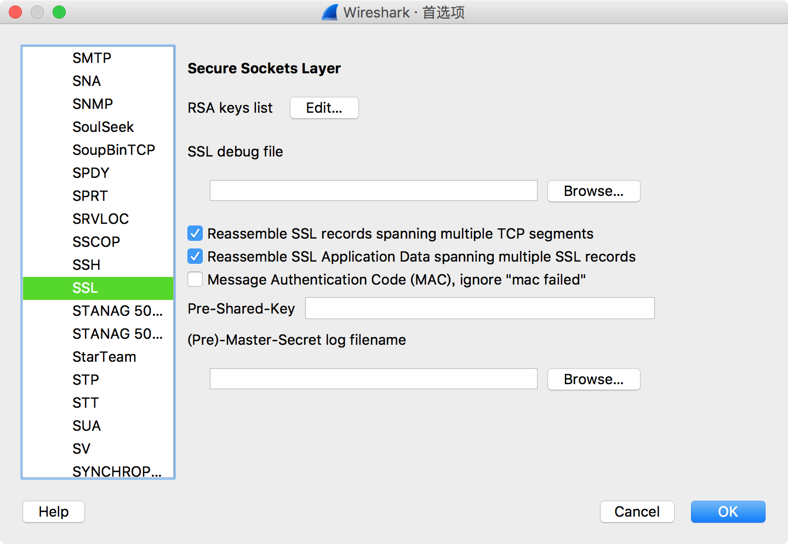
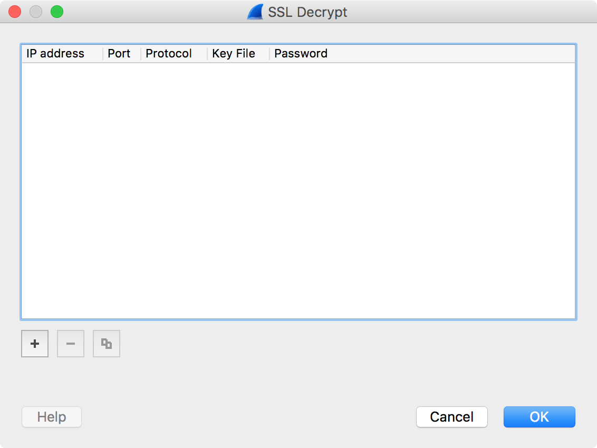
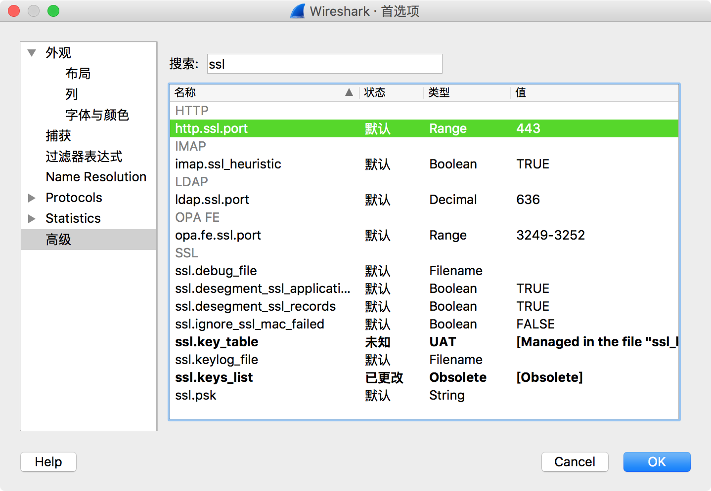
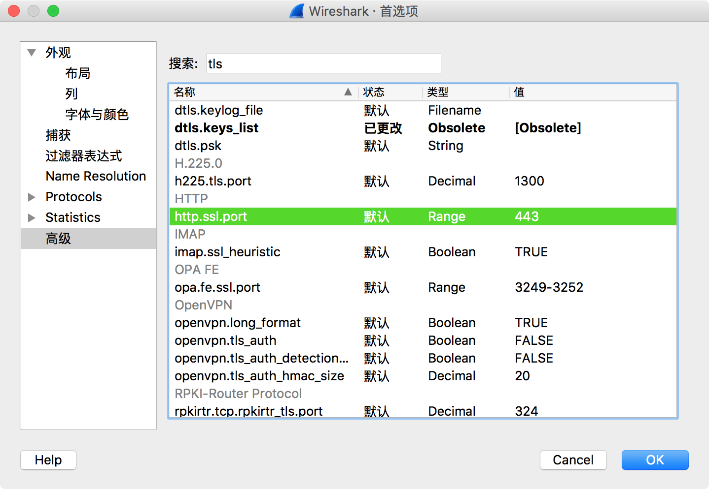

## Protocols

点击 `RSA keys list` 后的 **`Edit`** 打开 SSL Decrypt 窗口，Wireshark 只要[导入密钥](https://sanwen8.cn/p/27ebPa7.html)就可以自动解密出明文。

## 高级
默认的 `http.ssl.port = 443` ，如果更改为其他端口，则抓包的 **Protocol** 可能无法解析出标准 443 端口的 TLS handshake 的 `Client Hello`、`Server Hello`、`Certificate`、`Server Hello Done`、`Client Key Exchange`、`Change Cipher Spec`、`Encrypted Handshake Message` 等报文。

可以将 8443 等自定义 HTTPs 端口添加到 `http.ssl.port` 的 Range 中：

